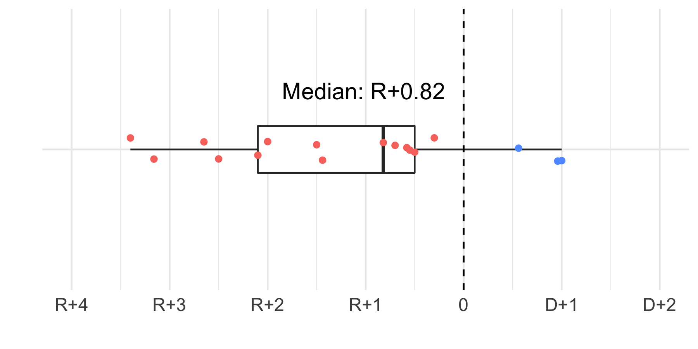
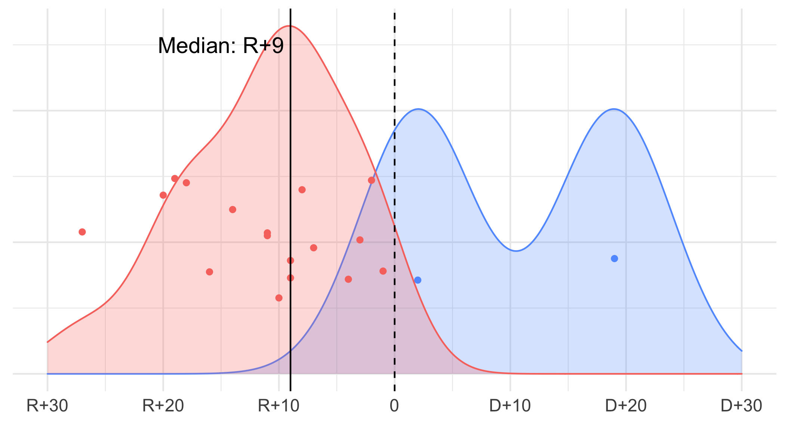
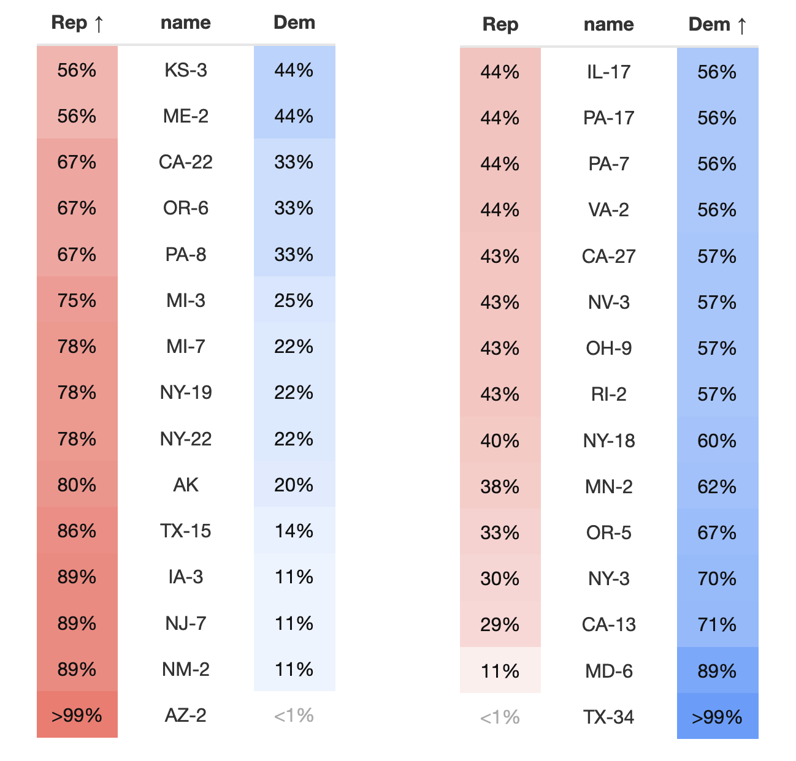

This webpage is a collection of election analytics blogs made by student forecasters in the course Gov 1347 at Harvard University (taught by Ryan Enos with teaching fellow Kiara Hernandez and course assistant Yao Yu). 

The goal of these blogs is to provide **descriptive analyses and regularly updated predictions around the outcome of the 2022 House of Representatives midterm election**. Forecasters use rigorous quantitative and statistical methods and political research to make scientifically-informed commentary around different facets of the race (e.g., the economy, ad campaigns). 

## Summary of forecasts

Below is a series of graphical and tabular summaries of our class's forecasts for the 2022 House of Representatives election. We can see from **Figure 1** that, overall, Republicans are slightly favored to win the two-party popular vote with only **<u>3</u>** out of our 23 forecasts predicting that Democrats will come out ahead in the two-party popular vote.

<h3><b>Figure 1: Projected Two-Party Popular Vote Win Margin</b></h3>

As we approach Election Day, voters [appear to prefer Republicans over Democrats in Congress](https://projects.fivethirtyeight.com/polls/generic-ballot/) by a `1.2%` margin[^1] on average. **Figure 2** shows that the majority of our forecasters also predict that Republicans will take control of the House by 9 seats on average. This brings the final distribution to 227 seats for the Republican Party and 208 seats for the Democratic Party.

<h3><b>Figure 2: Projected Seat Majority of Gov 1347 Forecasts</b></h3>

What do these forecasts tell us about the tightest House races this cycle? For forecasters who created state-level models, we'll focus on **30** of the closest districts and break down what the models say about them. While the forecasts say that each party is expected to take **half** of these districts, there is a noticeable tighter margin for districts that lean towards the Democratic candidate. Out of the 15 seats the predictions say will go to Democrats, 8 seats are within 10 percentage points to a tie while among the same group for Republicans, only 2 seats are predicted within 10 percentage points to a tie.

<h3><b>Figure 3: Gov 1347 Tight District Forecasts</b></h3>

Taken together, the Gov 1347 forecasts tell us that the Republicans are expected to win a majority of seats in the House. The real question still remains, just how many seats will that be?

## Forecaster blogs

* [Julia Blank](https://julia-blank.github.io/electionanalytics/), Junior in Government (Data Science)
* [Jackson Delgado](https://jrdelgado2018.github.io/GOV1347), Senior in Statistics
* [Lucy Ding](https://dinglucy.github.io/election-analytics/), Junior in Government (Data Science)
* [Joshua Doolan](https://joshua-doolan.github.io/GOV1347-Blog-Posts-F22/), Senior in Applied Math
* [Claire Duncan](https://claire-duncan.github.io/blog-electionanalytics), Junior in Government
* [Kaela Ellis](https://kaelaellis.github.io/Gov-1347/), Junior in Government
* [Ellie Grueskin](https://egrueskin.github.io/Gov1347), Junior in Economics
* [Jen Hughes](https://egrueskin.github.io/Gov1347), Junior in Government
* [Ethan Jasny](https://ethanjasny.github.io/gov1347), Sophomore in Government (Data Science)
* [Ethan Kelly](https://ethanckelly.github.io/analytics), Sophomore in Government
* [Kate Lim-Shim](https://hungrykaterpillar.github.io/election-blog/), Sophomore in Social Studies
* [Yusuf Mian](https://yusufmian2.github.io/Election-Blog/), Sophomore in Government (Data Science)
* [Jacob Moore](https://jacobtarin.github.io/election-analytics-blog/), Senior in Government (Data Science)
* [Vivian Nguyen](https://vivian-1372.github.io/Election-Analytics/), Junior in Government (Data Science)
* [Charles Onesti](https://charlesonesti.github.io/Onesti_GOV1347_Blog/), Senior in Computer Science
* [June Park](https://junekimpark.github.io/election-blog/), Junior in Government (Data Science)
* [Annelies Quinton](https://anneliesq.github.io/Gov1347-Blog/), Sophomore in Government (Data Science)
* [Giovanni Salcedo](https://salcedog404.github.io/election-blog), Senior in Government (Data Science)
* [Luke Tomes](https://luke-tomes.github.io/election-blog), Junior in Government
* [Hannah Valencia](https://h-valencia.github.io/Election-Analytics-Blog), Senior in Economics
* [Harris Walker](https://github.com/harrywalker146/electionanalytics), Senior in Statistics
* [Kento Yamada](https://kentoyamada100.github.io/election-analytics-2022-midterms), Junior in Government (Data Science)
* [Meredith Zielonka](https://merzielonka.github.io/ElectionAnalytics), Sophomore in Government (Data Science)

 

[^1]: Poll Aggregate as of November 7, 2022.
